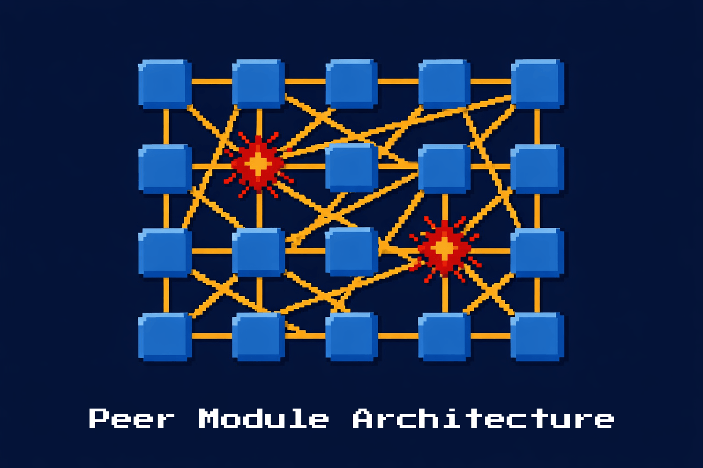

I didn't set out to create a new architectural pattern. I just wanted to build something that didn't make me mad.

I've spent 20+ years in the PHP ecosystem, and a big chunk of that was Magento -- a platform that gets a lot of things right about extensibility, and a lot of things wrong about developer experience.

And then there's Laravel, which nails the experience part, but trades away the deep modularity and extensibility that large-scale applications need.

I kept wanting both. Not a compromise, but both, fully, at the same time. So I built <a href="https://marko.build" target="_blank">Marko</a>.

What came out the other side wasn't just a framework, but a pattern I hadn't seen before.

## The pain that started it

If you’ve ever worked with Magento, you know the feeling. You need to change how a method behaves on a class you don't own. Magento lets you do that with plugins, preferences, and observers -- and that's genuinely powerful. Most frameworks don't even try!

But then you're writing XML. Lots of XML.

Your route is in one XML file, your layout is in another, your DI configuration is in a third, and your actual PHP code is somewhere else entirely. Two languages are standing side-by-side, describing one system, and they have to always stay in sync.

When they don't, you get a silent failure, which leaves you wondering why something isn’t working. It’s because when the XML merges together, the last file wins -- and nobody tells you that a conflict happened under the hood.

Laravel is the opposite experience. Everything is clean, expressive, PHP-native, and developer-friendly. But just try to modify a vendor package's behavior without forking it -- I dare you! Your options are extremely limited to what the package author explicitly made extensible, which is always something like a middleware hook here, or an event dispatched there.  If the package developer didn't anticipate what you need to modify, you’re stuck creating a patch which is ugly and unmaintainable.

I wanted the power of Magento's extensibility, with the developer-friendly experience of Laravel, but I wanted it all written in PHP.

Not XML. Not YAML. Not a DSL. Just PHP.

## What I accidentally built

As Marko took shape, I kept making small decisions that felt obvious individually, but turned out to be architecturally significant together. Each one solved a specific pain point that I'd felt when working with these other platforms. And I didn't realize it until much later on in the process that the combination of them was architecting something new.

Here are the four decisions that matter.

### Everything is a module, and every module is equal

In most frameworks, there's a distinction between "framework code" and "your code." The framework is special. It bootstraps, it provides, it controls. Your application extends it, but it's always a guest in the framework's house, and you aren’t able to override any of it.

In Marko, there is no distinction between code. Framework code, vendor packages, and your application code are all modules that follow the same structure. The same `composer.json` + `module.php` shape. The same discovery mechanism. The same override rights.

Your `app/blog` module can do everything `marko/core` can do.

This wasn’t in some grand architectural vision. But it was an obvious answer to a practical question: why should the rules be different depending on who wrote the code or where it lives?

### Any module can modify any other module's behavior

This is the one that comes from Magento, but refined. Plugins let any module intercept any public method on any other class, and let you do so without the target module needing to cooperate. Preferences let you swap one class in for another, and observers let you react to events.

The key phrase is *without the target's cooperation*. In Laravel, if a package doesn't fire an event or add a middleware hook, you can't extend that behavior cleanly. In Marko, every public method can be intercepted by default. The target doesn't need to opt-in.

This is powerful, but it's dangerous if you don't have the next piece in place.

### Conflicts are loud, not silent

This is where Marko diverges from Magento quite sharply.

In Magento, if two modules try to configure the same thing, XML merge rules decide the winner. Silently.

You might not discover the conflict until it ships off to production, or when something behaves differently than you expected because a third-party module you installed three months ago is silently overriding a binding you didn't know existed.

Marko refuses to do that.

If two modules at the same priority level bind the same interface, the framework throws an error. Not a warning or a log entry, but a loud, clear error that says: "These two modules are in conflict. Here's what each one wants. You need to decide."

The override priority chain is explicit and deterministic: `vendor/` (lowest) < `modules/` (middle) < `app/` (highest). Higher layers can override lower layers, but within the same layer, any ambiguity is not tolerated.

This is what makes the universal interception safe. You *can* modify anything, but you can't do it accidentally or silently.

### One language for everything

This one seemed like a stylistic preference at first, but it turned out to be the largest structural advantage to create extensibility without confusion.

Marko uses PHP for everything. Module configuration is within a PHP array in `module.php`. Routes are PHP attributes on controller methods. Bindings are PHP expressions.

There's no XML, YAML, or DSL.

This matters more than it sounds like it should. When your configuration is just PHP:

- Your IDE understands all of it. Autocompletion, refactoring, find-usages -- they work on your config the same way they work on your code.
- Static analysis covers all of it. PHPStan can catch a bad class reference in `module.php` the same way it catches one in a service class.
- The runtime validates all of it. There's no "the XML was valid but referenced a class that doesn't exist" failure.
- Conflict detection works uniformly. When two PHP statements try to bind the same interface, the container catches it in the same runtime and with the same error handling. There's no translation layer where information gets lost.
- AI tools understand all of it. When your routes, bindings, and config all in PHP alongside your code, AI assistants can reason about the entire system in one pass. There’s no context-switching between XML and PHP, and no missed connections because the wiring lives in a different language than the logic.

Magento's XML creates a parallel configuration system. Rather than having two languages describing one system, Marko keeps it all in one language, which means the loud conflict resolution, the module equality, and the interception system all operate in the same space. They reinforce each other rather than battling against each other.

## The pattern

I've started calling this setup the **Peer Module Architecture**.

Peer Module Architecture is defined by four properties that are held together simultaneously:

1. **Universal Module Equality** -- all modules follow identical rules regardless of origin
2. **Non-Invasive Universal Interception** -- any module can modify any other's behavior without the target's cooperation
3. **Loud Conflict Resolution** -- ambiguity between modules is always surfaced and never resolved silently
4. **Homogeneous Configuration** -- one language for code, config, and metadata, which eliminates layers of complexity and translation

Most frameworks give you one or two of these. But something interesting happens when you have all four in place at once.

Universal interception without loud conflicts is dangerous (Magento's silent XML merges). Loud conflicts without module equality is limiting (framework code plays by different rules). Module equality without homogeneous configuration is fragmented (you reason about the system in two languages).

But all four together create something where the whole system is extensible, inspectable, and safe.

## What makes it “peer”

The word “peer” captures the core insight: every module is a peer. No hierarchy, no special framework code, no guests in someone else’s house. Peers interact with each other freely, peers have equal rights, and peers can override each other through the priority chain.

It also comes from the Open/Closed Principle -- code that is “open for extension, but closed for modification” -- but elevated from class design to system architecture. Every module is open to extension by every other module, not by opt-in, but by default. You extend behavior without modifying source code, across module boundaries, with the framework enforcing the rules.

## The comparison

Here's how this maps against other frameworks I've worked with:

| Framework | Equal Modules | Universal Interception | Loud Conflicts | Single Language |
|-----------|:---:|:---:|:---:|:---:|
| Laravel | no | no | no | mostly |
| Symfony | partial | no | partial | mostly |
| Magento 2 | yes | yes | no | no |
| Drupal | partial | yes | no | no |
| **Marko** | **yes** | **yes** | **yes** | **yes** |

Magento is the closest to Marko, and that's not a coincidence. But the two differences -- loud conflicts and single-language configuration -- aren't just minor improvements. They fundamentally change the developer experience from "pray the merge order is right" to "the framework tells you when there's a problem”.

## The accidental part

I want to be honest about this: I didn't design Peer Module Architecture from the top-down. I didn't read a paper and implement it. I had pain points, and I solved them one at a time.

The module equality came from being frustrated from the fact that framework code and application code played by different rules.

The interception came from knowing how powerful Magento's plugin system is, and not wanting to give that up.

The loud conflicts came from needing to grok through hundreds of XML files, and getting burned by silent code merges one too many times.

And the single-language decision came from simply not wanting to write XML anymore.

Each decision was practical, and the pattern emerged from the combination of these different aspects.

I think that's actually how most good architectural patterns happen. They're not invented in theory and applied to code, but discovered in code and named afterwards. The naming just makes it possible to talk about what's there after the fact.

## What's next

Marko is still early. There's a lot to build -- a layout system (in PHP, naturally), additional driver packages, and better tooling for AI digestion. But the architectural foundation feels right in a way that's hard to explain

It's the kind of thing where every new feature I add just cleanly fits into the patterns of the framework without fighting each other.

If you're curious and want to learn more about Marko, the code is on GitHub at <a href="https://github.com/marko-php/marko" target="_blank">github.com/marko-php/marko</a>, and the docs are available at <a href="https://marko.build" target="_blank">marko.build</a>. It's MIT licensed, and I'd love feedback from anyone who's felt the same frustrations that I’ve had when working within other frameworks.

I didn't set out to create a new design pattern, but just wanted to build something that didn't make me choose between simplicity and extensibility. It turns out that when you refuse to compromise on something, you might just wind up creating something new.
