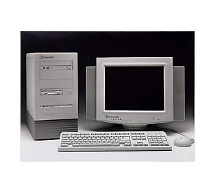
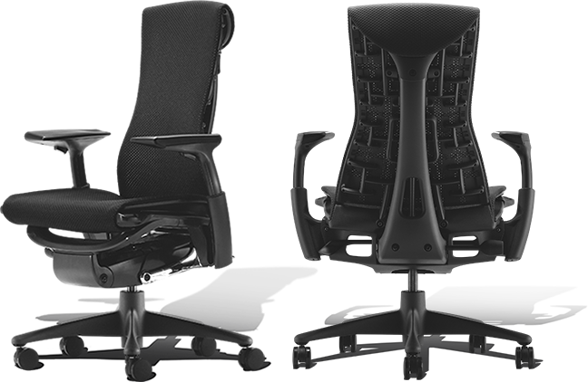
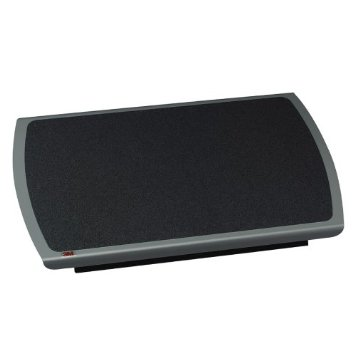
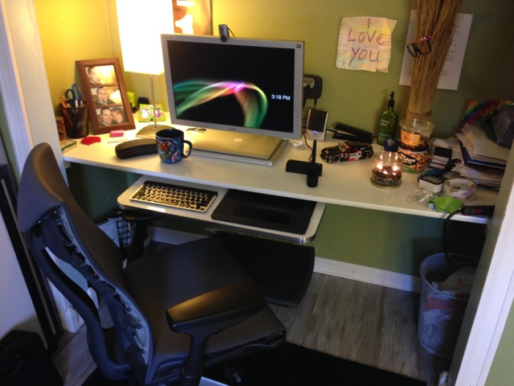
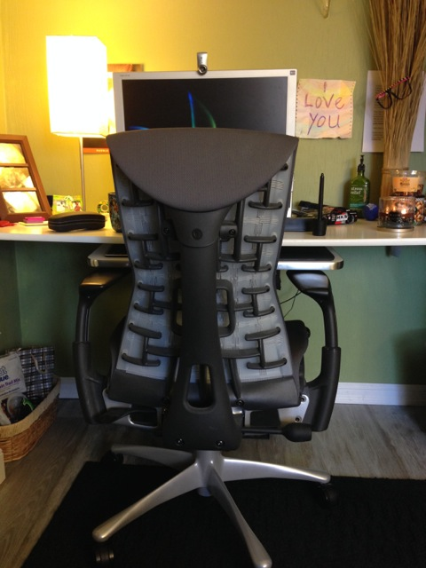
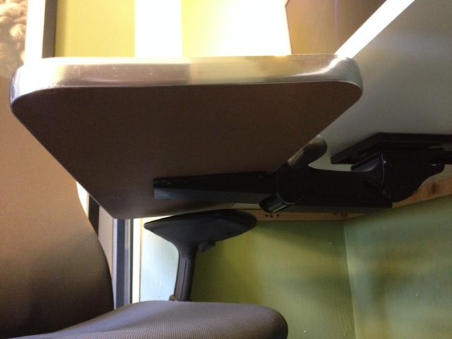
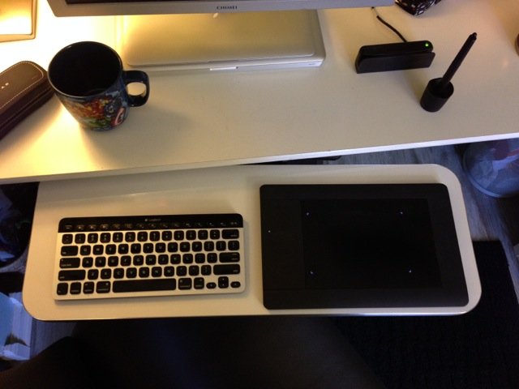
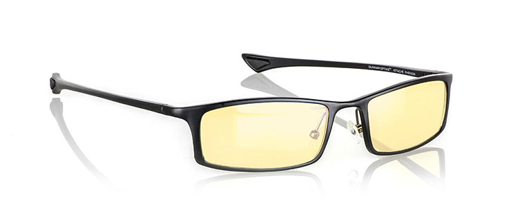

**Note:** An updated version of this blog post is available: [The ergonomic workstation for programming and screencasting](/2019/12/28/ergonomic-workstation-programming-screencasting/).

Let’s start off by saying that I work a solid 8 to 10 hours a day on my computer, 5 or 6 days a week, as a computer programmer. These long and strenuous hours take a toll, especially when you deal with the added stresses of starting your own business, and the ability to motivate yourself when working from home. I’ve had back problems since I was about 12 years old, and it’s no coincidence that this is just about the exact time that I got my first computer, a Packard Bell Pentium Pro.

I used to come across magazine articles going into the benefits of having an ergonomic workstation, and reading those articles usually concluded with me laughing at the ridiculousness of spending over $1,500 on a chair and hundreds of other dollars on what seemed to be useless accessories, only reserved for the hoity-toity. Flash forward 25 or so years later, and here I am. A hoity-toity. Well, not exactly.

I’ve been visiting the chiropractor every two weeks for the last couple years, and my back has been getting progressively worse. At 29, I now can’t even go a few days without back pain. Of course, I have stretches and exercises to do, which make my back feel significantly better, however, there is one thing that no matter what I did would just keep getting more uncomfortable and more uncomfortable as things got better or worse with my back: my office chair.

I started getting serious about the prospect of dropping a grand or so on a chair when I started googling and came across Jeff Atwood’s blog, and eventually a page on <a href="http://blog.codinghorror.com/investing-in-a-quality-programming-chair/" target="_blank">Investing in a Quality Programming Chair</a>. Here Jeff is, a computer programmer just like me, who makes some amazing points why every programmer should buy a quality computer chair. I read this article about a hundred times, and then started the extreme research efforts of ergonomic chairs. While it was fun to look at all of the crazy looking chairs from outer space, it started to take a toll on me to even pick out the correct chair that would suit me perfectly.

Jumping ahead almost a year after purchasing my <a href="https://amzn.to/38pPjz4" target="_blank">Herman Miller Embody</a>, let me give you some great advice from a fellow computer programmer (or even long-hour office employee): don’t wait one more minute before buying an ergonomic chair. Put cost aside, and think of your health & the toll your daily office routine takes on you. Stop researching online, and go visit a local hoity-toity place that actually carries these chairs, so you can test it out. In my opinion, the Embody will fit just about anyones body, and I’ve heard nothing but great things about this chair, but nothing beats sitting in the chair that you spend a third of your life in. It's hard to get a feel for a chair over even a few hours, so see if you can rent one for a few weeks if that is a possibility.

After sitting on the Embody all day, it doesn’t stand out. It’s not plushly comfortable, doesn’t feel like you are sitting in a water bed, and doesn’t feel like a Lay-Z-Boy. What it does provide you with is an even more amazing experience: forgetting you are even sitting in a chair. Gone is the long pain and back aches, or the need to shift my body’s position every 10 seconds to get comfortable. I’m always comfortable. The back of the chair moves with you; it’s not a stiff, uncomfortable back like pretty much any other chair, the flex flexes with your spine. It’s unbelievable. Mind you, I still have back pain, but it doesn’t develop from my chair and stay in my brain every moment of every hour when I program, or prevent me from working (very) long hours. I still take breaks, but find myself being able to work in this chair for hours and hours without moving, and anyone who is a programmer who has went on all-day and all-night benders knows just how awesome this is.

Having this wonderful chair experience, I immediately became an advocate of everything ergonomic. The next purchase I made, based on everyone’s suggestions and comments online, was a <a href="https://amzn.to/2P8SiEI" target="_blank">3M adjustable foot rest</a>. What? A stupid $70 place I can put my feet on? Well, use one, and you’ll know why you need one. It takes the stress off of your legs almost completely, and is almost as big of a difference as an ergonomic chair. I have not regretting this purchase for even one day, and the 3M foot rest is a very high quality item.

So what’s next? A keyboard tray, of course. Typically, I’ve been dead-set against these. I’ve hated having the mouse and keyboard on different levels, and hated the uselessness of having a tray in the way when an office table would do just fine. But you know what? The <a href="http://www.versatables.com/products/deluxe-keyboard-arm-and-tray/" target="_blank">deluxe keyboard arm and tray from Versa Tables</a> is on another level. I’ve always also worked on a <a href="https://amzn.to/356iHbO" target="_blank">Wacom Intuos tablet</a>, given that the mouse clicking and trackpad tapping gives me extreme carpal tunnel side effects (my whole hand goes numb after using a trackpad for more than a couple hours).

This aside (and also the tablet being something I would recommend, as the pen gives me no carpal effects at all), I needed a keyboard tray which would fit both my keyboard and Intuos tablet on one plane, and the 28” Versa does just that. It also completely pivots, adjusts and angles to my exact desired position, and takes some stress off my hands. Note that you need a very adjustable chair to bring the armrests all the way down in order to properly adjust the keyboard tray to the best position.

As far as specifics go of where to angle the monitor (I still need a decent monitor stand), what pivot to have the keyboard tray, how to position your chair, etc. — I found out that this is entirely reliant on every individual person. Everyone likes to work differently, and what works for one person my not work for another. Test out different positions, and find out what is most comfortable for you.

Here are some pictures of my setup. If you are planning on working six or more hours in front of your computer, for your own health please don’t wait any longer, and give in to the couple grand of purchases which will make your entire daily life that much better.

**Bonus:**

Also get some Gunnar's. I have the <a href="https://amzn.to/2LGfUye" target="_blank">Gunnar Phenom's</a> (which fit my enormously fat head). Removes the eye strain from your monitor just about completely. I feel like superman with these on and don't know how I got by without them. I now cannot work more than an hour or two without these without my eyes hurting.
